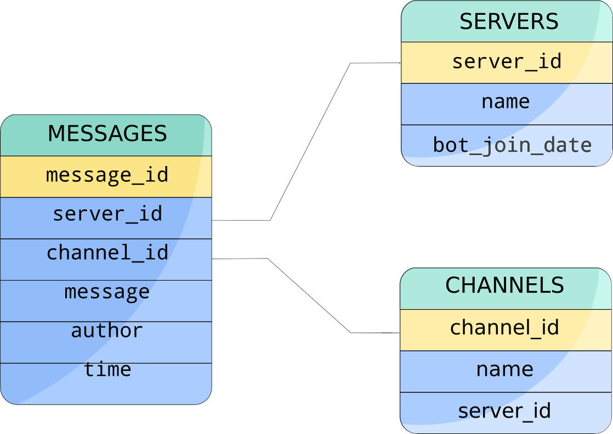

# discordLoggerBot

> A bot to log everything in a discord server... don't lose your stuff :)

## Overview:

The aim of this project is to implement a Discord Bot in Javascript (Node.js) using `discord.js` and the Javascript 
`sqlite3` module. This bot will make a copy of each messaged posted inside a Discord server and place it in a secure database for future retrieval.

**Requirements:** The bot requires the `discord.js` and `sqlite3` modules to be installed with NPM.

## The Database:

The database used by the bot is impemented on SQLite3. The architecture of the Database is as shown:  

