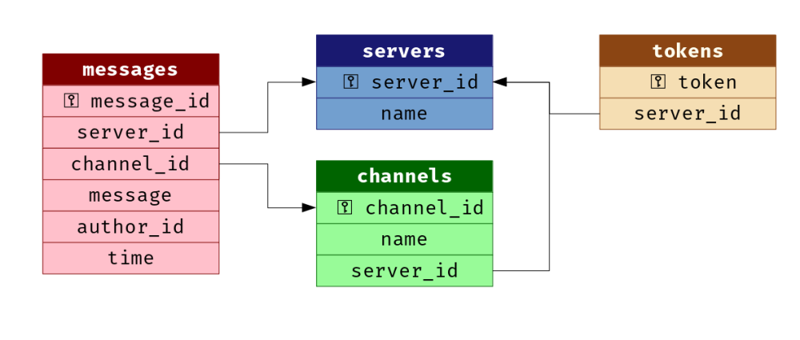

# discordLoggerBot

*A bot to log everything in a discord server... don't lose your stuff* :)

## Overview:

Disregarding multiple requests from a wide variety of people, Discord LLC has refused to implement a backup copy of messages stored on channels and guilds of their chatting service, Discord. When a chat message, or worse - a chat channel - is deleted even by an accidental misclick, it is permanently deleted from Discord's data storage. Neither Discord nor Droplets - the cloud hosting platform Discord is built on - implements any persistence for data deleted by users, no even for 5 minutes in the event that the data was deleted by a misclick or a mistake.

This has caused significant anguish to a variety of people, including some of the collaborators on this project. In recognition of the need to back up cherished memories of conversations on the Discord channels we share with close friends, this project implements a method to back up Discord data. 

The aim of this project is to implement a Discord Bot in Javascript (Node.js) using `discord.js` and the Javascript `sqlite3` module. This bot will make a copy of each messaged posted inside a Discord server and place it in a secure database for future retrieval.

**Requirements:** The bot requires the `discord.js` and `sqlite3` modules to be installed with NPM.

## The Database:

The database used by the bot is impemented on SQLite3. The architecture of the Database is as shown:  

The database values are updated using the methods in `Bots/databaseUtils.js`, and are read using `viewer/querryrunner.js`

## TODO:

 1. Basic viewer is completed, but the token system to ensure that people can only view channels in their server needs to be implemented.
 2. The viewer UI needs improvement.
 3. The timestamp is currently implemented in the database as text, this will limit query capabilities.
